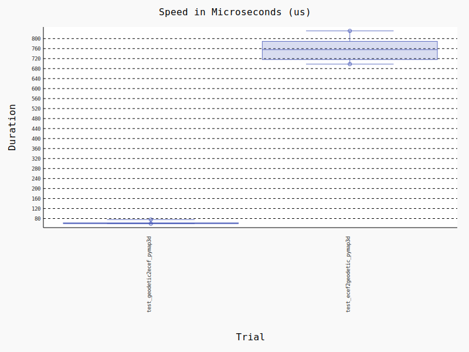

# rustmap3d


[](https://gitlab.sdo.psdo.leidos.com/alphamosaic/registry/-/packages)
[](https://github.com/astral-sh/ruff)

<p align="center"></p>

**Simple, fast, and ergonomic geodetic coordinate conversions**

## Benchmarks

Compared to pure python equivalent code in [pymap3d](https://github.com/geospace-code/pymap3d)

- *50x* faster for lla2ecef
- *400x* faster for ecef2lla

<p align="center"></p>

```bash
# Run benchmarks
uv run pytest --benchmark-histogram="./docs/benchmarks" bench/
```
